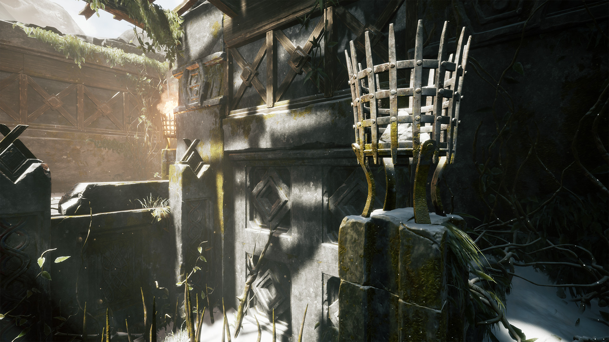
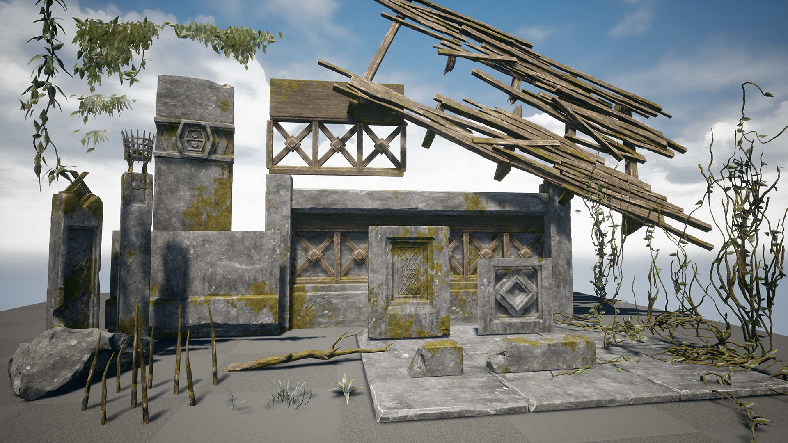
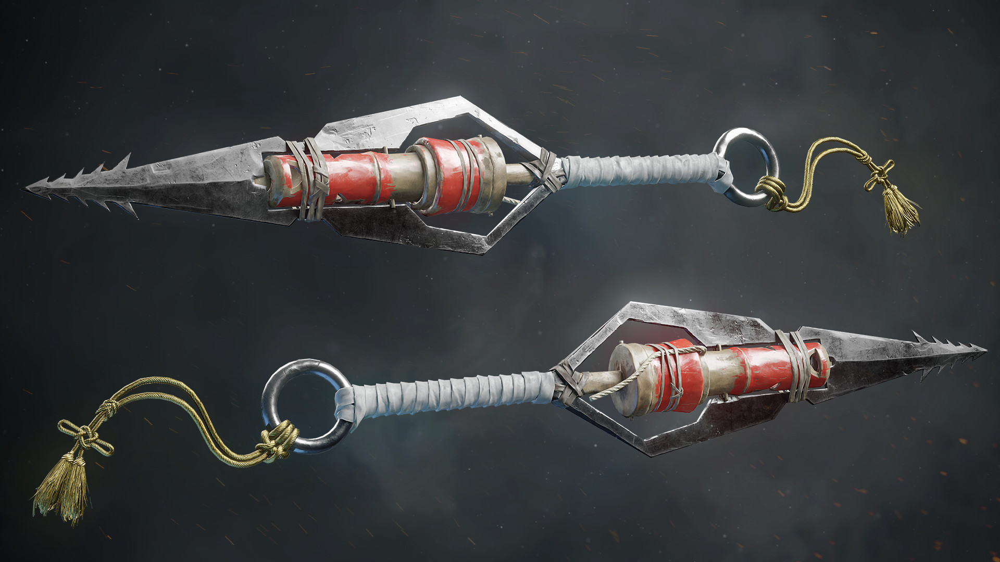

I've always liked making art. I went to an art high school and was doing a lot of 3D art at the time. I learned about composition, lighting, 3D techniques and how to work with programs like Blender, Substance Painter & Designer, Zbrush and Unreal. I was on my way to becoming a game artist! Then I got really hooked with programming and it has since become my main focus.

I still take a lot of the knowledge with me to my programming projects. Making creative 3D tools is something I want to do, and I think being a user of the tool you're creating is the key to making it amazing. I also just often launch Blender for visually debugging vectors, planes, transforms, etc. when programming and I can't live without it!

---
[Full portfolio link](https://www.artstation.com/eeromutka)