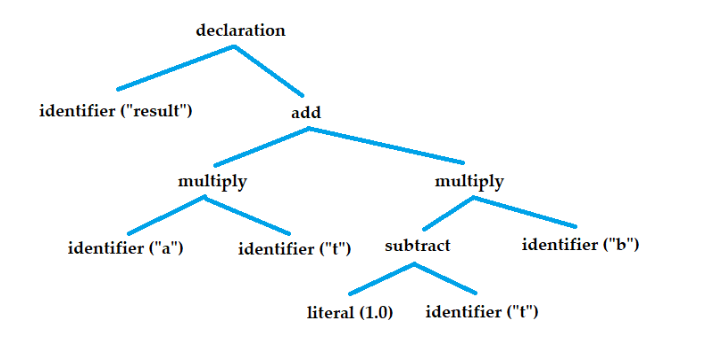

I wrote a compiler for a simple programming language I designed to learn more about compilers and to see how far I'd get. Here I describe my process of creating it and what is required to take a text file and to turn it into an executable.

<!--more-->

The motivation for this project came from multiple places. One was that I wished there existed a nice, simpler C/C++ alternative. C++ is very complicated. Everyone has to pick a subset of features to use, and the larger the subset, the less people can easily follow it. Coding styles often follow this complexity: if you've gotten a long cryptic error message from `std::` template code, you know what I mean. Building other people's code and integrating libraries can also be a pain. Although simpler, C has its rough edges too, like its order-dependent declarations, the fact that you can't just return `float[3]` from a function, and that you can't easily make reusable code modules without starting to put prefixes to all names. There are just a lot of things that could be improved. Still, the main motivation for this project was the idea of having the compiler be an easy-to-use, modular library. It would allow for interesting ways to code, e.g. allow for extending the language by the user or to allow for plugging it into new kinds of interactive programming tools, like a visual scripting system in a game engine.

So, how can I build my own little C/C++? I want my language to read text files and transform them into the magical .exe file that can be run by the computer. Let's start from the end, the executable file. The executable file depends on the OS, but it wouldn’t be too difficult to generate it myself. However, if I wanted to be able to use code made in other languages like C++ in my language, it’d be useful to use a linker. The job of a linker is to take in other magical files called object files (or static library files, AFAIK they’re kind of the same thing), and output the executable file. This way, I could compile code in other programming languages into object / static library files, generate an object file from my programming language, and link them together into an executable file using the OS-provided linker.

When I looked into generating object files, I found [this wiki page](https://wiki.osdev.org/COFF) helpful. An object file contains the compiled machine code that the target processor can execute. It’s basically a list of instructions for the specific processor kind (in my case X64), for each function. An instruction can for example add two values together or store a value into memory. Generating all of this is a bit complicated, especially since the object file format varies per operating system, and given that there are more processor architectures than just X64. There is one popular library that handles this, though, which is LLVM. A lot of compilers use it since it can output to lots of different target architectures and platforms and it can do advanced transformations that optimize the code to run efficiently. But from what I have heard and seen, it's a complicated beast with millions of lines of code and it's also very slow to run. I knew this from the start, which was the reason for why I dug into how I might generate these files myself. I want my language to be a joy to use, and part of that is having quick iteration times.

We could of course skip all of this difficulty and just generate source code for another programming language like C, and use their compiler as a second step. This is easy, and we will even get optimizations for free! But it will take longer to compile. And perhaps the biggest problem with this is the story of debugging. If you wanted to then debug your code, you'd be debugging an unreadable mess of generated C code. If we generate the object files directly, we can generate the debug information too just like the C compiler would, and use a debugger like Visual Studio to debug the code written in our language.

The solution I came to is to have two paths for the compiler:
1. Generate C code for when you want to get all the nice optimizations or make a build for a platform/architecture that's not supported by option 2.
2. Generate X64 object files directly with debug information, for quick iteration times and nice debugging

The first is easier to implement than the second, but the second is still necessary. I wanted to bundle this two-path backend into its own standalone library for anyone to use and learn from, kind of as a simple alternative to LLVM. I’m calling it GMMC, as in Give-Me-Machine-Code. GMMC was another reason I wanted to do this project - I felt like there’s a big spot missing for a simpler LLVM alternative, and if I were to make something like it, the language would be a good stress test for it. This backend needs to give the user a useful set of operations that can be easily generated into both C and X64. Since C is meant to be a low level abstraction, this ended up working quite naturally.

I could write a lot about making GMMC, but I’ll try to keep it short. Figuring out how to generate machine code and debug info wasn't so easy. So far I've only been working on generating object files on Windows. It took quite a bit of researching, testing and looking at bytes in a hex editor to get things to work, but the progress has been slow and steady. I initially learned about X64 assembly from [Creel's youtube videos](https://www.youtube.com/watch?v=rxsBghsrvpI). I also ended up using the [Zydis](https://github.com/zyantific/zydis) disassembler/assembler library for easily generating the actual instructions from code. If I wanted to know how something worked, I could always just invoke the C compiler and look at the generated file and compare it to a file I generated myself. [Godbolt](https://godbolt.org/) has also been helpful to quickly see how something would be generated in assembly. The Microsoft debug information was particularly annoying to figure out, because it's not documented anywhere, except as [a source code dump](https://github.com/microsoft/microsoft-pdb) from Microsoft that doesn't include everything and can't be compiled.

I now had a somewhat working compiler backend and it was time for the language itself. The basic idea is to read in the text files and build a tree structure out of it that holds a node for each little code unit, such as an addition operator, or a function definition. For example, for the following piece of code:
```
result: a*t + (1.0 - t)*b
```

... the abstract syntax tree looks something like:



This tree, often called the “abstract syntax tree”, is a lot easier to deal with than a string of text. Each node stores a pointer to its child nodes, as well as its parent node, so it’s easy to traverse through the tree. Generating the tree is pretty simple by eating characters from the code string and separating it into words/tokens and adding new nodes as we go. I would allocate each node from the same memory arena such that iterating the tree would be really fast with minimal cache misses. One thing that took a bit of pondering is dealing with operator precedence. For example, multiplication should get a higher priority than addition. In the end, I found a neat way to do it:

1. Build an array of the operators, i.e. {*, +, *}
2. Find the operator with the lowest precedence (i.e. the +). This will be the parent/root node.
3. Slice the array into two halves - a half that’s fully on the left side of the parent, and a half that’s fully on the right side.
4. We can find the left and the right child nodes for the parent node by recursing to step number 2. using the two slices.

Once we have the tree, we can traverse through it and make sure that the program is correct and contains no errors. We also need to give each node that can act as a value, a type (i.e. int, a float, bool, etc), and make sure that the types match or report an error otherwise. As a last step, if everything has succeeded, we traverse the tree again and start feeding it to GMMC, which takes it from there.

That's mostly it. Now, let me introduce the FFZ programming language! Here's a Hello World program in FFZ:

```
#Basic: import(":Basic")

#entry: proc {
	Basic.print("Hello, world!")
}
```

Design-wise, it’s pretty similar to C/C++. #entry: means that we’re declaring a constant named “entry”, with the value defined on the right-hand side. proc {} makes a procedure/function. import(“:Basic”) imports a module named “Basic”, and the colon indicates that it searches the module from a global module directory shipped with the compiler. Every declaration has an implicit type, making it easy to pull values into named variables:

```
#entry: proc {
	// the type of “hello_text” is string.
	hello_text: "Hello, world!"
	Basic.print(hello_text)
}
```

A factorial function could be written like so:

```
#factorial: proc(n: int) => int {
	if n <= 1 {
		ret 1
	}
	ret n * factorial(n - 1)
}
```

For a more real example, here’s a snake game [(source code)](https://pastebin.com/nTb7dVeC) I made in the language:


I’m calling external Raylib code to create the window and draw the graphics in this example. It’s really satisfying to make something that actually works in the language! Slightly less satisfying is having to fix all the bugs in the compiler in the process. I can also debug the program in a debugger like Visual Studio. Here's a video of that:


Note how I can inspect the values of local variables, hop around the call stack, and even step into foreign code!

The language design isn’t too fancy, but there are still some cool things about that I implemented:
- out of order declarations
- modules with name-prefixing
- string, array and slice types with range checking
- named function and struct initializer arguments with support for default values
- intuitive error messages
- parametric polymorphism, i.e. ability to implement a generic Array type

A challenge has been to decide which features I should add to the language. There are lots of useful features I can imagine I would want, but at the same time, I want the language to remain simple to implement and to understand, and I don't want to drown in work. I don't know if there are any right or wrong answers, I've mostly gone based on what feels right.

At the time of writing, the language is quite functional, but still incomplete. My goal was to finish it as quickly as possible and start using it for other projects. For now, I've benched it as there are other cool projects I want to work on. It would be a lot to take on at once to work a real project using an incomplete programming language that might contain bugs that need to be fixed. On top of that, I'm not the only one who's making progress in the field: work is being done towards an [LLVM alternative](https://github.com/RealNeGate/Cuik), which I'm excited for as it's definitely the most difficult part of this puzzle. Hopefully that project will keep maturing and I could use it in the future. In the meanwhile, I'm going back to C/C++ to work on other projects. Still, this has been a fun journey that has taught me a lot about programming and how computers work.

You can find the code for the FFZ compiler and GMMC at https://github.com/EeroMutka/ffz.
