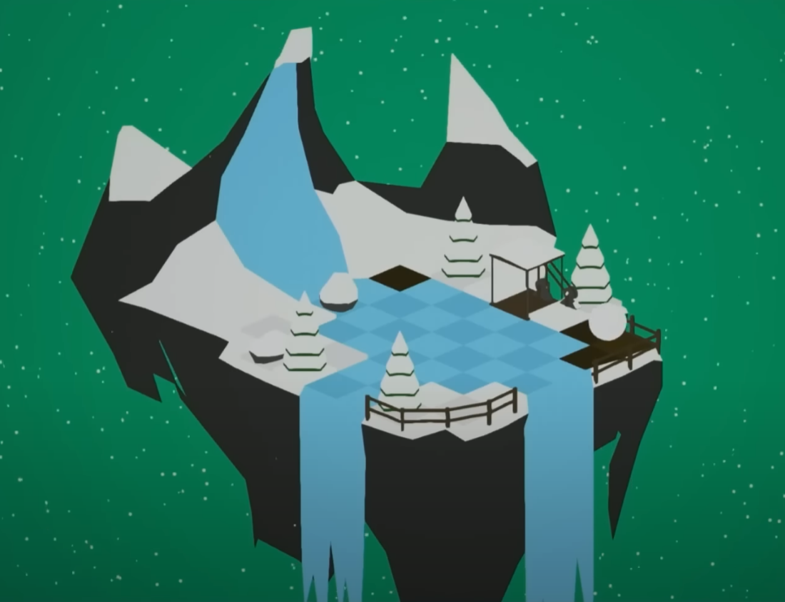
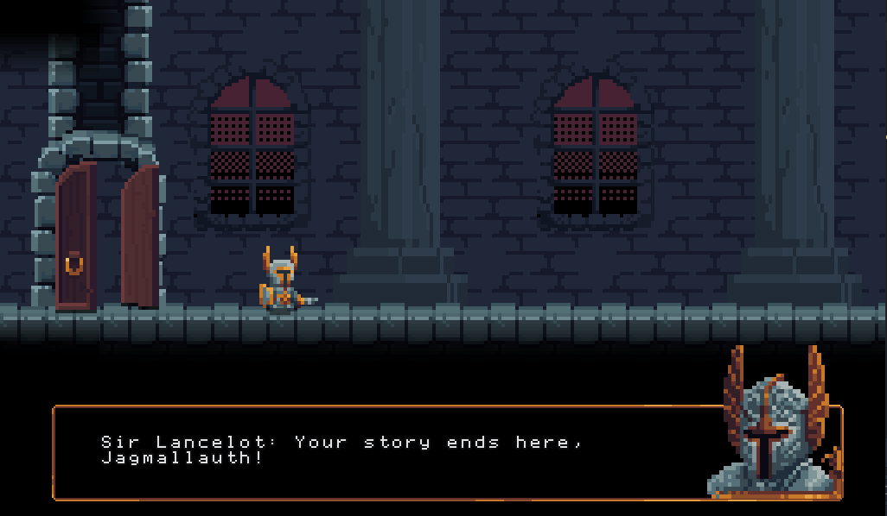

Game jams really got me hooked into game development when I first started out. I've participated in many game jams, both alone as well as in teams. Here are some fun highlights.
<!--more-->

# Angry Angry Dad
Have you ever been a dad wanting to watch a football match in peace, but everyone and everything keeps interrupting you? The theme for this jam was "spring into action", and so we had the idea of a dad springing out from his springy chair. I was a designer & UE4-blueprinter working with 5 other people I had previously met in the Unreal Engine community. It felt like we had a thousand tasks left to do all the way to the end, as we all couldn't stop putting more and more fun/unnecessary polish even if we didn't have the time. But we made it, and got a victory spot in the #UE4jam!

https://slapunas.itch.io/angryangrydad


# Not Enough Snow

The theme for this one was "Snowball Effect". I wanted to try making a puzzle game where you collect and release snow to control the size and position of your snowball. I was quite happy with some of the puzzles I designed and the visual look. Looking back, a lot of it could be improved though, for example I have no idea why I didn't make the snowball into a grid - that would have caused much less weird problems developing the mechanic. Nevertheless, this was my first one-person game jam victory, and by pure luck, mr. Tim Sweeney himself happened to play it on stream!

[Download link](https://drive.google.com/file/d/0B25pMCuV01BYR09KWWZpdHdxQTQ/view?usp=sharing&resourcekey=0-5h2ZfHg1onsebTzi8uLJ_w)


# Jagmallauth

It must feel so powerless to be an epic videogame boss when these tiny protagonists somehow come and beat you over and over again against all odds. This was the feeling we wanted to convey in our game me and my friend made for the GMTK 2020 game jam where the theme was "Out of Control". In the game, you fight against this annoying little knight that is really difficult to beat. In fact, it's impossible. If you are good and manage to get him to 0 HP, he will just take a health potion. At 5:06 in the video, the somewhat hidden ending is shown. We both worked on art, animations and programming, and made the game in 48 hours.

https://eero-mutka.itch.io/jagmallauth


# Futal Project

One of my first game jams, the theme for this was "Spring into the future". I got the idea of making a puzzle game, something portal-like but with a time travel mechanic. I was surprised by how easy the time traveling was to implement in blueprints - all I had to do was to record your movement into an array of world transforms, and then play them back on a clone of yourself. I was pretty proud of some of the puzzles I came up with.

[Download link](https://drive.google.com/file/d/0B25pMCuV01BYVzlueG1BMUxGeGc/view?usp=sharing&resourcekey=0-qSYS67lXAUppZeH_9b7E7g)


# Beef Up!

The theme of the summer 2018 ue4jam was "Well that escalated quickly", so I naturally made a game about escalating cows. You're a farmer and you try to protect your cows from being kidnapped by aliens. I made everything myself except for the music and the cow model. I used blender for modeling + substance painter for texturing the models. I had no time to make animations so I slapped a ragdoll on the player which worked nicely. Sadly, I failed to submit the game in time for the deadline, so it wasn't really played by many or judged. It was a fun experience nonetheless and I think the game ended up surprisingly fun!

https://eero-mutka.itch.io/beef-up

