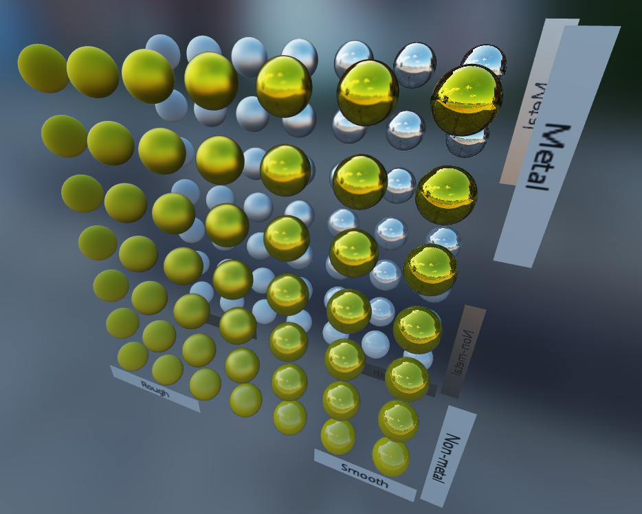
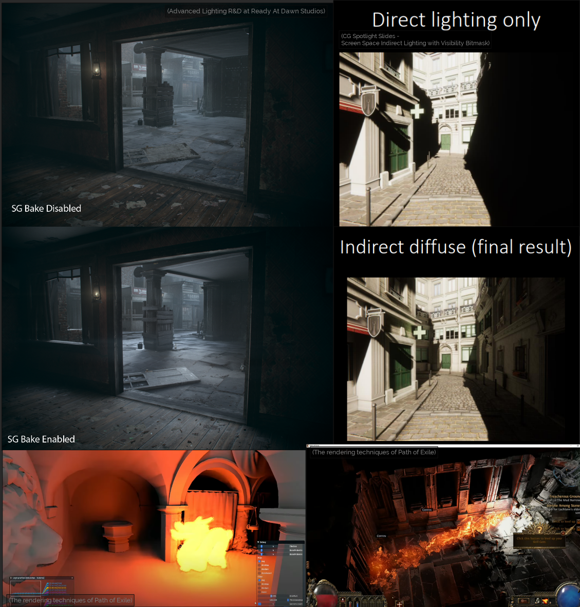
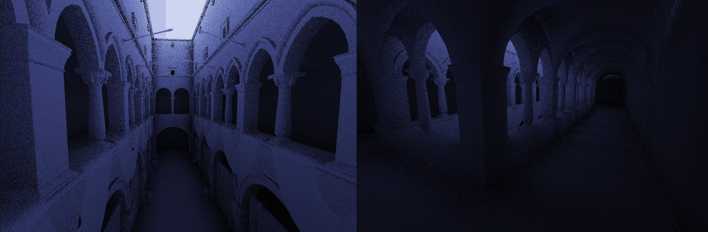
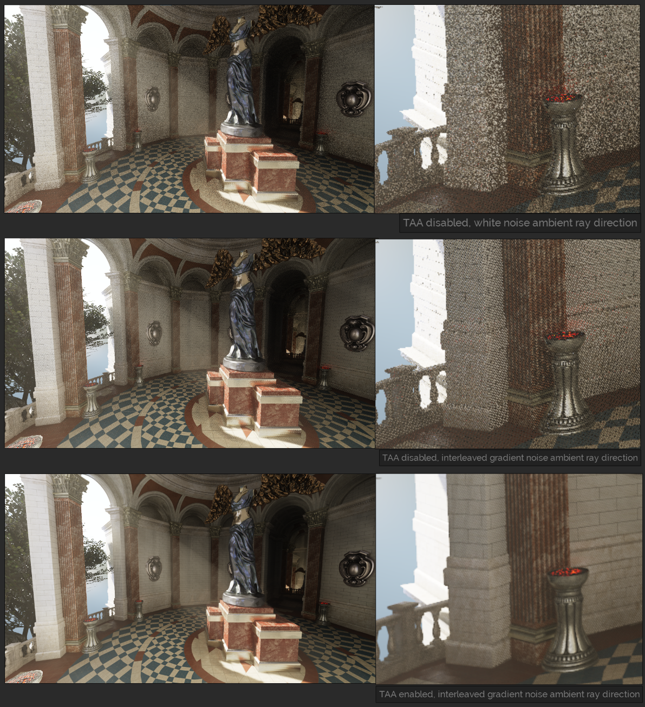
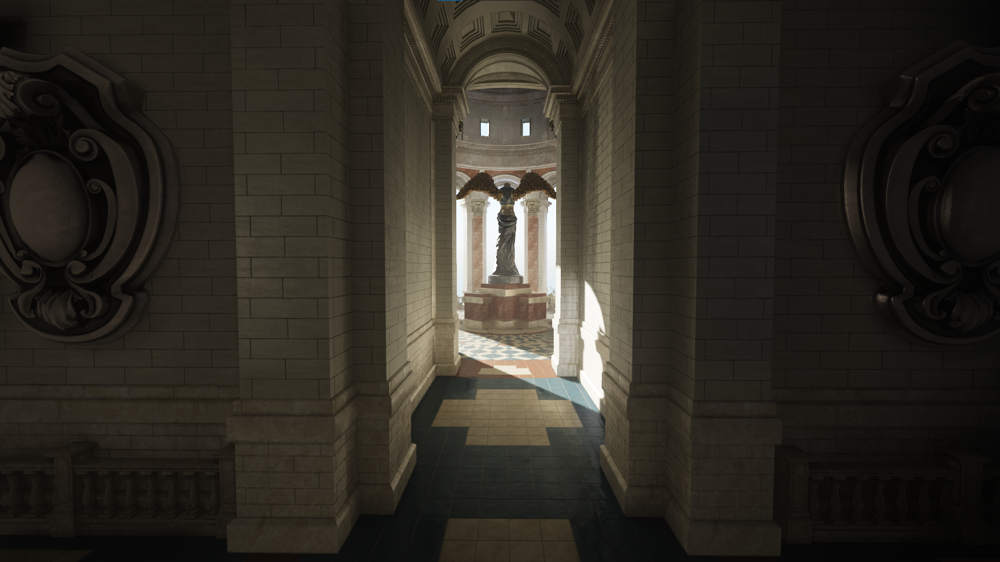

The goal of this project was to combine all my learnings of shader and graphics programming into one unified renderer. I wanted to implement modern rendering techniques and add some of my own experiments on top, and to improve my understanding of Vulkan.

<!--more-->


*Showcase of my vulkan renderer running in real-time*

Before this project, I had already made a few toy renderers and had a pretty good understanding of many rendering techniques, but I never went the full way to make something really polished. So I wanted to challange myself, and to learn how to do it with Vulkan.

Once I had a triangle, I started putting together a Vulkan abstraction layer to make iteration easier. Using Vulkan directly can be really tedious, a lot more than OpenGL which I had used before. I wasn't exactly sure how the abstraction should look like as I was still fresh to working with modern graphics APIs, but I knew I wanted iteration to be easy. I remember reading up on [render graphs](https://ruby0x1.github.io/machinery_blog_archive/post/high-level-rendering-using-render-graphs/index.html) and how they could automate some of the annoying work, so I kept them in mind. As a bonus, the abstraction would make it possible to add another graphics API backend in the future if I wanted to.

I made a few simple demos to try out the abstraction, such as a textured triangle, a blur shader and a simple 3D model viewer. Next, I wanted to make a simple physically-based rendering demo, which could load a textured model with albedo, roughness and metallic maps, and draw it using environment-based lighting. I did this to learn more about PBR and the math behind it.

When it comes to rendering techniques, I think global illumination is the holy grail. In principle, it's really simple: just send lots of light rays and make them bounce everywhere. It's also really hard to do well in real time. A lot of engineering and research is going into global illumination techniques (i.e. RTX raytracing, UE5 Lumen). I think it's the biggest differentiator in quality between real time graphics and offline raytraced rendering. Having nice bounced diffuse light, soft indirect shadows and indirect specular can look really good, but is tricky to make efficient.

One good way to do GI is to bake it into lightmaps, but I wanted to try making it dynamic such that lightmaps wouldn't be required. The idea I had was to take the basis of VXGI, which is voxelizing the world into a 3D texture, marking each voxel with either a radiance value or a blocker/wall, and running a simulation to flood light around it each frame. The light would then softly propagate from a light source (either a light-entity or an emissive surface), and slowly fade away in the distance creating areas of darkness. The idea differs from VXGI, where the idea is to generate a mipmap chain of the voxelized 3D texture and to sample from it with increasing mip-levels outwards from the surface normal in the main fragment shader. The reason I wanted to try my version was to avoid light leaks. With VXGI, if you had a house in direct sunlight and it had a dark room, then the floor of that room could incorrectly catch light from the outside as the mipmap-cone-trace could go trough the ceiling and catch light from the outside. With my light flooding simulation idea, light wouldn't go through objects.

First I made an experiment in 2D to see how this light flooding simulation could work, or if it even is possible:


It was looking promising, so I took it to 3D:

My idea was working! It's nice how the ambient skylight gets spread all the way to the bottom of sponza through the relatively narrow opening. The light in my simulation does not have any directional information, it just spreads everywhere evenly and can even bend around corners. I initially suspected that it would probably be fine, and in the end it was so I stack to it. In the above pictures and the final demo, I'm using a resolution of 128x128x128 for the light grid which covers the entire world.

It was time for the grand step, which was to combine it all with my PBR rendering code and some fun post-processing! I started by extending my simple PBR viewer. For model and texture loading, I'm using [assimp](https://github.com/assimp/assimp) and [ddspp](https://github.com/redorav/ddspp). Previously my code only supported one mesh and one material, but now I had to decide how I'd organize the draw calls and materials. Since it was simple to implement, I made it so that the entire scene is split into N draw calls and N descriptor sets, N being the number of materials in the FBX file. My plan was to make this renderer deferred to allow for more advanced post-processing shaders, so I started using G-buffers. Previously, I had only been using cubemap based lighting, but now it was time to add a sun light with a shadow map. I had already done this before in a past project, so it was easy to look at it for reference. I'm using a `samplerShadow` to take advantage of percentage-closer filtering, and doing 4 samples in a rotated-square pattern as this looked the nicest while still being efficient.

For the GI, my idea was to shoot screen-space rays and use the depth buffer for small-scale details. My light grid is too small resolution to account for all the small details, and screen-space tracing was my idea to combat that. Ray tracing techniques tend to converge slowly to the result, and high quality noise can be used to our advantage. Temporal anti-aliasing is another way to further reduce the noise. I ended up going with interleaved gradient noise due to its natural look. It's not perfect as it introduces some bias (i.e. see the dark spots on the wall in the middle of the image). Improving my sampling methods is something I'd like to keep working on. In the future, I could also try doing the calculations in a downscaled render target, and doing edge-aware blurring to upscale it, as this appears to be another common way to reduce noise and to improve performance.

As a reference reference for implementing TAA, I followed the following articles: [Temporal AA and The Quest for The Holy Trail](https://www.elopezr.com/temporal-aa-and-the-quest-for-the-holy-trail/), [Temporal Antialiasing Starter Pack](https://alextardif.com/TAA.html). I'm still not fully happy with it and I'll have to experiment with it a bit more, but it's good enough for now.

Now that I had TAA, I wanted to also add bloom. It's a sun temple after all! I followed the article [Physically Based Bloom](https://learnopengl.com/Guest-Articles/2022/Phys.-Based-Bloom) for reference. It was looking nice, but there were lots of bright pixels, or "fireflies" here and there even after I implemented weighted averaging as suggested for reducing them. So, my dumb solution for now was just to limit the dynamic range of the first downsample pass using `value = min(value, vec3(1));`. From my testing, this gives a nicer result than the suggested methods.

Here was how the renderer looked like at this point with everything implemented except for GI. In this version, I was also experimenting with [SSAO using visibility bitmask and screen-space bent normals](https://cdrinmatane.github.io/posts/cgspotlight-slides/), which I ended up not using in the final demo.



Next, I ported my GI system into this project. I also made the voxelization calculate a direct lighting value using the sun depth buffer and inject that into the light grid. This meant that the spots where the sun hits be a source of light for the flooding stage. In the following image, you can see the light grid visualized by ray tracing into it. For rough reflections and ambient light, it can be useful to not trace all the way, but to accumulate light on the path as if it was fog. This reduces noise since there is less variation between the directions. You can see the "foggy" version on the bottom.

After we have the light grid filled with some nice ambient light value for each voxel, we can sample from that in the main deferred lighting pass instead of sampling from the environment cubemap like we did before. We can implement a `vec3 FindIncomingRadiance(vec3 point, vec3 direction)` function that can then be called for both the ambient light, using a cosine-weighted direction on the hemisphere, and the specular light, using the reflected view direction which is nudged around randomly using the roughness of the surface as a scaling factor. The gist of what I ended up doing is, first find the closest point in the light grid which is empty space. From the ray origin to this open point is the "uncertain" zone, where the light grid resolution is too low to fully represent all the details. So, then I trace a screen-space ray from the ray origin up to this open point. If something is hit in screen-space, then the color at that point from the previous frame is returned. Otherwise, we can continue the original 3D light grid ray that we know for sure is safe to continue.

Implementing this function was the tricky part, and it always felt like there were some bright spots or light leaks coming from somewhere, or dark splotches of over-occlusion. Just relying on the depth-buffer is not enough information to be confident to know when the ray hits a surface, because you can't ask how deep some surface point in the depth buffer is. I realized that I could utilize my 3D light grid once again check for that, which helped reduce some artifacts. In the end, I got it to a presentable state, which I'm happy about!

Throughout this process, an enormous help has been that I implemented shader hotreloading. If you're not doing it, then stop and do it right now. It's so much easier to play around and try new things. Starting small in 2D and making my rendering experiments first in their own demos was also helpful. It made debugging and experimenting on those specific things easier, without worrying about all the other features that would be required in the full version. Easy iteration is the key!

