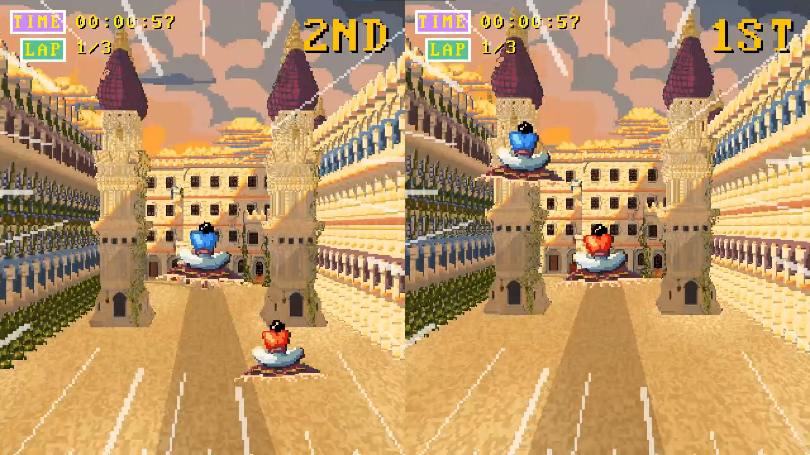

---
date:	0000-00-100
title:  "Rug Racers: Ultimate"
description: "Play against your friend, family member or a complete stranger and race to be the first over the finish line."
comments: true
math: true
featured_image: 'banner.jpg'
---

[Rug Racers: Ultimate](https://kuehldy.itch.io/rugracers) is an arcade flying-carpet racing game where you race against your friend on a physical carpet. I was the lead programmer responsible for making the core systems and a large part of the gameplay code, and I also took part in the design process. We were a 6-person team and made the game during a 10 week long school course. The game won 2 awards at Gotland Game Conference, as well as got nominated at Swedish Game Awards!


*Gameplay footage starts at 0:49*

We wanted the game to feel like an old arcade racing game such as OutRun, so at start we researched how such graphics were rendered back in the day. Due to the unconventional renderer and level design, I suggested to use [Raylib](https://www.raylib.com/) and C++ instead of an engine like Unity. This way we could hand-craft the renderer to get exactly the feel we want.

This meant that we gave up many tools - how would we design levels without an editor? I had an idea to use an image editing program as the level editor. By having a single image per entity-kind (i.e. small house, big house, tree), we could put them on different layers and place entities by painting pixels into them. Each image would be a top-down map of all entities of a kind in the level. With hot-reloading and some in-game debug controls, level editing became quite fun! To control the height of an entity (i.e. for clouds and birds), we made the brightness of the pixel control the height.

On top of this, we had a JSON file where we exposed tweakable variables that would be hot-reloaded on change. Me and the other programmer would expose as many variables as possible so that anyone on the team could tweak the game. We knew that not using an engine was a risk by possibly adding too much dependency on us programmers, so we tried to fight this as much as possible by being smart with our tools.

I implemented the editor system and the core part of the renderer. Another interesting problem I tackled was the input system. The idea was to attach a nintendo switch controller to each carpet and use the motion sensors to move up, down, left and right in the game. Since we used C++, I could quite easily [use a library](https://github.com/JibbSmart/JoyShockLibrary) to get sensor input and send rumble feedback from/to the controllers.

A joycon has both an accelerometer and a gyroscope sensor. The accelerometer tracks acceleration in each axis, while the gyroscope tracks the angular momentum about each axis. We wanted the player to move up when the carpet was held up, down when it was held down, and similarly for left/right. So I wanted to know the absolute position of the controller. The way to derive it from the sensors is to, in theory,

1. Calibrate the controller at a neutral position (the middle)
2. Accumulate the acceleration to get the velocity
3. Accumulate the velocity to get the position

The problem is that very quickly due to small errors, step 2. and 3. start drifting away from the true velocity and true position. I experimented with various ideas and they all felt weird. An added annoyance was that the gravity of the earth would show up in the accelerometer input, meaning I'd have to subtract it in code and sometimes it wasn't completely balanced. Another solution would be to use the rotation of the joycon instead of its position as the input direction, but getting that would also require accumulating the angular momentum to get the absolute rotation.

Then I realized how dumb I had been - the gravity of the earth showed up in the accelerometer inputs, that's the key! When the controller is stable, the accelerometer input is around (0, 10, 0), while when it's rotated 90 degrees, it's (0, 0, 10). So I could use the accelerometer to track the absolute orientation of the controller. After some smoothing was applied to get rid of small bumps, and adding some gyroscope input to the mix for quick sharp inputs, it all felt quite natural!

I even made a little carpet-controlled text editor for entering your name into the scoreboard in the game. You can see it in the video above at 2:29. This was the true challenge of the game to many players.

The game can be found at https://kuehldy.itch.io/rugracers
